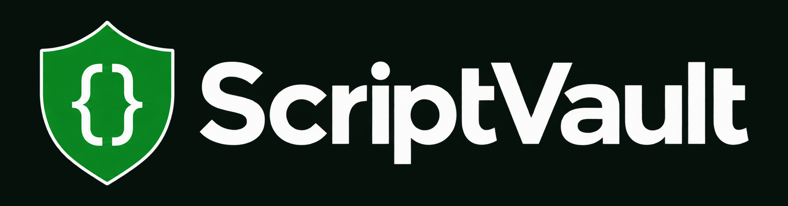
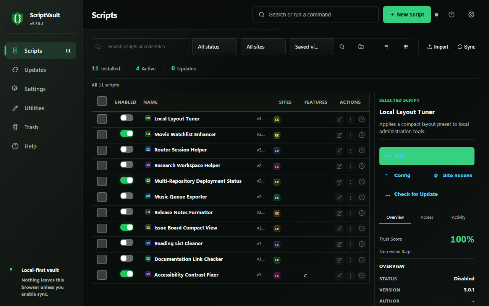
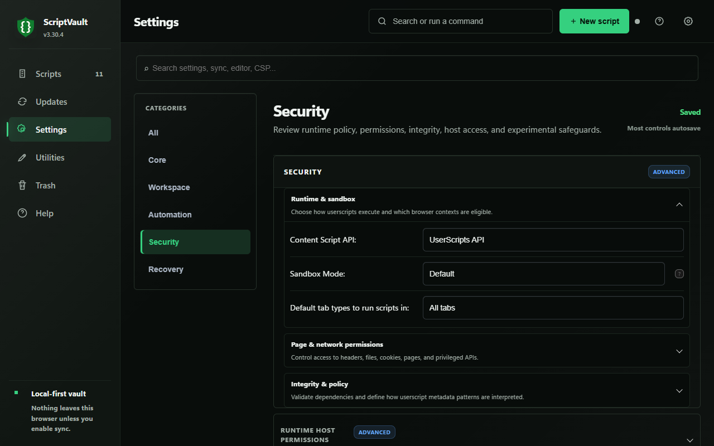
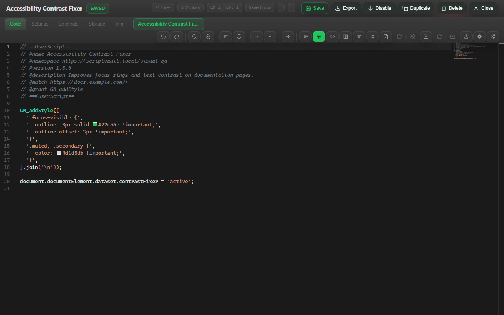
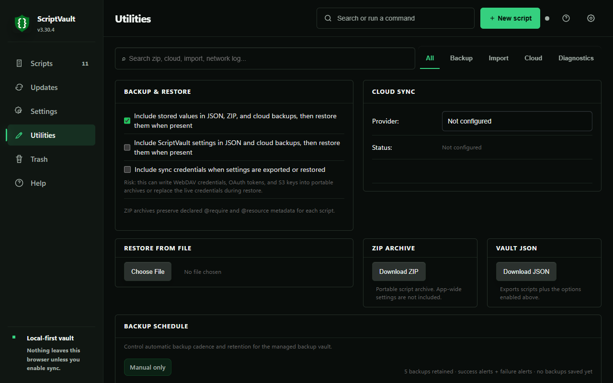
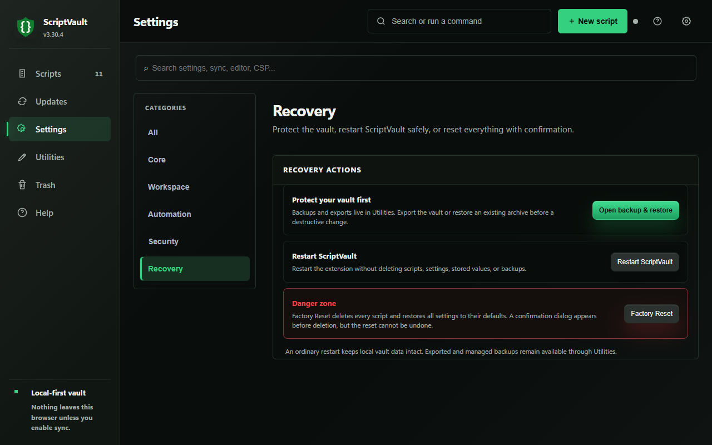

<p align="center">
  
</p>

<h1 align="center">ScriptVault</h1>

<p align="center"><strong>Install, inspect, and run userscripts without giving up control.</strong></p>

<p align="center">
  
  
  
  
</p>

<p align="center">
  <a href="https://chromewebstore.google.com/detail/scriptvault/jlhdbkeijcbgnonpfkfkkkhfmbeejkgh"><strong>Install from the Chrome Web Store</strong></a>
  &nbsp;&bull;&nbsp;
  <a href="https://github.com/SysAdminDoc/ScriptVault/releases/latest">Download the latest release</a>
  &nbsp;&bull;&nbsp;
  <a href="#install-from-source">Build it yourself</a>
</p>

ScriptVault is a local-first userscript manager for people who want to see what
a script can do before they trust it. Every install gets a permission review
and static risk analysis. Updates wait in a review queue instead of replacing
working code behind your back.

Your library stays on your device unless you turn on sync.

## See the workbench



<table>
  <tr>
    <td width="50%"></td>
    <td width="50%"></td>
  </tr>
  <tr>
    <td align="center"><strong>Security settings that explain the tradeoff</strong></td>
    <td align="center"><strong>A full editor with metadata checks and live diagnostics</strong></td>
  </tr>
  <tr>
    <td width="50%"></td>
    <td width="50%"></td>
  </tr>
  <tr>
    <td align="center"><strong>Portable backups and optional sync</strong></td>
    <td align="center"><strong>A clear line between restart and reset</strong></td>
  </tr>
</table>

## Why ScriptVault

| What matters | How ScriptVault handles it |
|---|---|
| Install safety | Shows requested grants, matched sites, source details, and a 31-detector AST risk report before a script is saved. |
| Update control | Checks and downloads are separate. Review the code diff and permission changes before applying an update. |
| Daily management | Search, saved views, folders, workspaces, bulk actions, and per-site controls live in one desktop workbench. |
| Recovery | Keeps recent versions, sends deleted scripts to Trash, and supports complete ZIP or JSON backups. |
| Local privacy | No account and no telemetry. Scripts, settings, values, logs, and backups remain local by default. |

## A serious userscript toolchain

### Review before install

Open a `.user.js` URL and ScriptVault intercepts it for review. The install page
shows metadata, requested capabilities, match patterns, update sources, and
static-analysis findings. Broad access is visible before you accept it.

### Edit without leaving the browser

The sandboxed Monaco editor supports multiple tabs, generated GM API types,
metadata linting, code folding, themes, snippets, and version diffs. Script
settings keep their Saved or Unsaved state beside the editor, so there is no
guesswork about whether a change stuck.

### Keep updates deliberate

Automatic checks can notify you without applying anything. The update inbox
puts old and new code beside each other, calls out permission changes, and keeps
rollback context close to the decision.

### Run where you intend

Global denied hosts, blacklist mode, and whitelist mode sit above each script's
own `@match`, `@include`, and `@exclude` rules. You can pause all scripts for a
site from the popup or control matching scripts from the side panel.

## Compatibility

ScriptVault implements more than 36 Greasemonkey and Tampermonkey APIs,
including promise-based `GM.*` forms.

| Area | Representative APIs |
|---|---|
| Values and state | `GM_getValue`, `GM_setValue`, value listeners, tab state, `GM.withLock` |
| Network | `GM_xmlhttpRequest`, `GM.fetch`, `GM_download`, `GM_webSocket`, `GM_webRequest` |
| Browser UI | menus, notifications, clipboard, tabs, cookies, audio |
| Resources and DOM | `GM_getResourceText`, `GM_getResourceURL`, `GM_addStyle`, `GM_addElement` |

The runtime also supports `@top-level-await`, `@delay`, `@nodownload`,
`window.onurlchange`, script signing, UserCSS, and isolated cookie jars.
Generated declarations are available at `lib/scriptvault.d.ts`.

`GM.fetch` shares the guarded `GM_xmlhttpRequest` network path and enforces the
script's `@connect` hosts. Modern browser contexts expose the response body as a
`ReadableStream`; older contexts use the existing buffered response path.

#### Trusted Types and MAIN-world DOM Writes

Most ScriptVault scripts run in the browser `USER_SCRIPT` world. That world is
separate from a page's Trusted Types policy, so normal DOM creation and
`GM_addElement` keep working on strict sites.

If a script intentionally switches to MAIN/page context or uses `unsafeWindow`,
the page policy applies. Prefer `textContent`, `append`, `createElement`, and
`GM_addElement` with attributes. A site that requires a `TrustedHTML` object
must supply or approve the policy used to create it.

### Languages

ScriptVault ships English plus 8 explicitly partial translations: German,
Spanish, French, Hebrew, Japanese, Portuguese, Russian, and Chinese. English is
complete. In the partial catalogs, untranslated runtime messages fall back to English.
Hebrew uses right-to-left document direction.

### Optional sync

Cloud Sync* can use WebDAV, a browser-selected local folder, Google Drive,
Dropbox, OneDrive, or S3-compatible storage. Easy Cloud and GitHub Gist are
available as separate flows. Credentials can be kept in session storage so
they disappear when the browser closes.

*Firefox sync currently supports WebDAV. OAuth providers are deferred because
the Firefox package does not request the `identity` permission.

## Install

### Chrome Web Store

[Install ScriptVault from the Chrome Web Store](https://chromewebstore.google.com/detail/scriptvault/jlhdbkeijcbgnonpfkfkkkhfmbeejkgh).

Chrome 138 and newer require one extra browser setting:

1. Open `chrome://extensions`.
2. Select ScriptVault, then Details.
3. Turn on **Allow User Scripts**.

Chrome 120 through 137 use the main Developer mode switch instead. ScriptVault
shows setup guidance if the required API is unavailable.

### Install from source

```bash
git clone https://github.com/SysAdminDoc/ScriptVault.git
cd ScriptVault
npm ci
npm run build
```

Then open `chrome://extensions`, enable Developer mode, choose **Load unpacked**,
and select the repository folder.

The development toolchain uses Node.js **24.18.1**, npm **11.16.0**, and
TypeScript 7.0.2.

### Firefox validation build

Firefox is a tested packaging target, not a published AMO listing.

```bash
npm run firefox:package
npm run smoke:firefox
```

The output lands in `firefox-artifacts/`. Firefox v1 is intentionally textarea-first.
Monaco is omitted from the Firefox package until a pruned local editor bundle has AMO lint proof,
so the editor falls back to the textarea adapter.

## Browser Support Matrix

<!-- SCRIPT_VAULT_BROWSER_SUPPORT_MATRIX:START -->
_Last generated: 2026-09-07 with `npm run support:matrix`. Version source: `manifest.json` / `manifest-firefox.json` 3.30.4._

_Chromium cadence note: Chrome moves to a 14-day stable cadence at M153 (2026-09-08), or about 26 milestones per year. ScriptVault supports M130+; measured against M153, that is a 23-milestone / approximately 11-month calendar window, expressed as an explicit milestone floor rather than a rolling last-N assumption._

| Browser | Support level | Tested version / target | Last successful verification | Verification evidence | Unsupported or deferred APIs |
|---|---|---|---|---|---|
| Chrome / Chromium | Tier 1 published target | Chrome 130+ MV3 | 2026-09-07 | `npm run smoke:dashboard`, `npm run cws:check`, local Chrome ZIP packaging with `bash build.sh` | Chrome 138+ requires per-extension Allow User Scripts; current-site recovery uses Chrome 133+ `permissions.addHostAccessRequest` when available and falls back to `permissions.request({ origins })`; per-script `worldId` is Chrome 133+ and feature-gated |
| Microsoft Edge | Tier 1 compatible package; Partner Center publication manual | Edge 130+ Chromium MV3 package | 2026-09-07 Edge sideload smoke passed; package/report generated | `npm run build:edge:check`, `edge-artifacts/scriptvault-edge-v3.30.4.zip`, `edge-artifacts/edge-build-3.30.4.json`, `npm run smoke:edge`, `edge-artifacts/edge-smoke-3.30.4.json`; local release attaches `edge-artifacts/*` manually | Manual Partner Center upload remains required until a live Edge Add-ons listing exists; Microsoft Edge Add-ons REST update automation is deferred until listing identifiers and publisher credentials are provisioned; Dedicated local Edge sideload smoke passed on 152.0.4191.62; dashboard, popup, userScripts toggle, save/toggle, and local target execution were verified |
| Firefox Desktop | AMO validation target, not a published listing | Firefox 140.0+ MV3 | 2026-09-07 | `npm run firefox:package`, `npm run smoke:firefox`; web-ext lint 0 errors / 0 notices / 59 warnings | `sidePanel`, `offscreen`, `identity` OAuth, and some `userScripts.execute` flows are unsupported/deferred; host grant/revoke diagnostics listen to permissions events; Firefox package omits Monaco until the Firefox editor-loading pass |
| Firefox for Android | Deferred; not an AMO compatibility target | No current `gecko_android` manifest target | 2026-09-05 | `manifest-firefox.json` intentionally omits `gecko_android` until an Android smoke gate exists | Android UI/runtime, extension-action overlay, host-permission, import/export, and WebDAV paths are unverified |
| Brave / Vivaldi / Opera / Arc | Chromium derivative local-smoke targets | Chrome 130+ compatible package | 2026-09-07 local smoke passed: Brave | `npm run smoke:derivatives`, `chromium-derivative-artifacts/summary-3.30.4.json`, `chromium-derivative-artifacts/brave-3.30.4.json` | Vivaldi, Opera, Arc were not installed for the latest local run; store policy, shields/sidebar behavior, and extension UI chrome remain browser-specific |
| Orion / Safari | Not supported | Not a current target | Not verified | No build, smoke, or package path | Requires separate WebKit/Orion validation and likely native Safari extension work |
<!-- SCRIPT_VAULT_BROWSER_SUPPORT_MATRIX:END -->

## Permission and Privacy Review

ScriptVault requests `<all_urls>` because installed scripts need to run on the
sites declared in their metadata. The **Require approval for all-site scripts**
setting adds an install-time guard for universal scripts. It does not remove the
extension's browser-level host permission.

There is no telemetry. Network access happens only when a user action or an
installed script calls for it, such as checking an update source or making a
declared `GM_xmlhttpRequest`.

Read the full [privacy policy](PRIVACY.md), [store permission copy](docs/store-listing-copy.md),
and [remote-code compliance memo](docs/cws-remote-code-compliance.md). Security
reporting and supported versions are documented in [`SECURITY.md`](SECURITY.md).

The release gate keeps manifest permissions and public copy in step:

```bash
npm run store-copy:check
npm run cws:remote-code:check
npm run permissions:check
```

## Back up or move an existing library

ScriptVault imports common Tampermonkey, Violentmonkey, Greasemonkey, and
ScriptCat backups. Imported scripts go through review, and unsupported fields
are reported instead of being discarded silently.

For a complete ScriptVault backup, open **Utilities / Backup and Restore** and
export a ZIP. It includes scripts plus settings and can be restored on another
profile.

## Build and verify

```bash
npm ci
npm run build
bash build.sh
npm run check
npm run test:e2e:release
npm run test:visual
npm run smoke:dashboard
npm run smoke:editor
```

All browser runs use isolated temporary profiles. Screenshot capture also
rejects unexpected external HTTP requests from extension-owned pages.

For a complete credential-free release rehearsal:

```bash
npm run release:preflight -- --version 3.30.4
```

It writes logs, reports, and the requested ZIP under `release-artifacts/`.
Store submission and public release checks remain separate because they require
maintainer credentials.

## Project map

```text
ScriptVault/
  manifest.json                 Chromium manifest
  manifest-firefox.json         Firefox manifest
  src/                          TypeScript sources and locale catalogs
  modules/                      Runtime services
  pages/                        Dashboard, popup, side panel, and install UI
  tests/                        Unit, browser, accessibility, and security tests
  scripts/                      Build, smoke, screenshot, and release checks
  images/                       Extension icon family
  assets/brand/                 Selected logo masters and GitHub banner
```

`background.js`, the Monaco runtime, and browser packages are generated. Edit
their source modules, then run the normal build before committing.

## Contributing

Issues and focused pull requests are welcome. Start with a clean install, run
`npm run check`, and include a browser exercise for anything that changes a
user flow. UI changes also need fresh screenshots at the repository's standard
viewports.

## License

ScriptVault is available under the [MIT License](LICENSE).

<p align="center"><strong>ScriptVault v3.30.4</strong></p>
